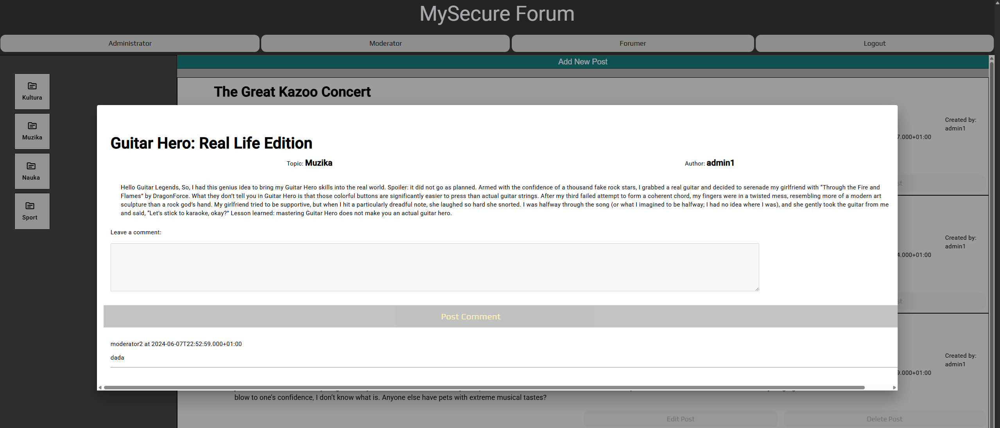

# My Internet Forum — Angular + Spring Security Edition

Because the internet always needs *one more forum*, I built a fully-fledged discussion platform as a college project.  
This wasn’t just about making “yet another CRUD app” — the main goal was to flex Spring Security’s muscles, play with Angular on the frontend, and give it all a custom handmade style (no Bootstrap, no Material, just pure native CSS love ❤️). Note: I am not the best CSS stylist nor was a sweet-looking CSS design the main focus of this project, however I did try my best to make some decent looking components and style classes.

---

## 🚀 Tech Stack
- **Frontend**: Angular (hand-crafted UI, no prebuilt components)
- **Backend**: Spring Boot + Spring Security
- **Database**: MySQL
- **Authentication**: JWT + Two-Factor Auth (e-mail codes) + OAuth2 (Google/GitHub)
- **Extra Security**: Web Application Firewall (WAF), certificate management, SIEM logging

---

## 📖 Problem Statement
The task was to create an internet forum where registered users can exchange opinions across different topics.  
The system supports three user roles with escalating superpowers:

- **Admin** 🦸: manages users, permissions, and decides who gets in or out  
- **Moderator** 🛡️: manages posts and comments, approves or rejects them  
- **Forumer** 💬: the everyday forum user, posting in themed rooms (ex. Science, Culture, Sports, Music)  

---

## 🔑✨ Key Features
- User registration with admin approval (via e-mail notification)  
- Two-Factor Authentication (password + e-mail code)  
- OAuth2 login (Google/GitHub)  
- Role-based access (Admin, Moderator, User)  
- JWT-secured sessions  
- Custom-built **Web Application Firewall** with content validation  
- SIEM-style security logging  
- Fully custom CSS design (hand-rolled, no libraries)  

---

## 🏗️ Architecture
Here’s the high-level system design:  


- **Access Controller**
  - Every request flows through here first.  
  - Validates requests against defined security policies, blocks malformed/malicious ones, and only forwards clean traffic deeper into the system.

- **JWT Authentication & Authorization** 
  - Users log in with username + password → if successful, they receive a **JWT token**.  
  - The token is then attached to every subsequent API request.  
  - **Without a valid token, you’re not getting in** — the API is locked down.  
  - Roles (Admin, Moderator, User) are baked into the token claims and are validated on every request.

- **JWT Controller**  
  - Issues and validates tokens.  
  - Talks to the **MySQL database** to fetch the user’s role and permission set.  
  - Keeps sessions stateless — no sticky sessions needed, just token verification.

- **SIEM (Security Information and Event Management)**
  - All security-relevant events (failed logins, invalid tokens, blocked requests, suspicious payloads, etc.) are logged.

- **Web Application Firewall (WAF)**
  - Scans all incoming requests.  
  - Rejects inputs that don’t conform to defined rules (max text length, disallowed sequences, SQL-injection attempts, etc.).  
  - Can terminate suspicious sessions early.

- **Certificate Controller**
  - Ensures **end-to-end encrypted communication** both between the client and the server and across internal components.

  ---

  # Implementation:

  ## ⚙️ Backend

The backend is powered by **Spring Boot** and follows a clean **Entity → Repository → Service → Controller** pattern:

- **Entities**
  - Represent database tables, e.g., `UserEntity`, `PermissionsEntity`, `CommentEntity`, `ForumPostEntity`, etc.  
  - Include JPA annotations to handle relationships, constraints, and data validation.

- **Repositories**
  - Extend `JpaRepository` to provide CRUD operations.  
  - Include custom queries.

- **Services** 🛠️  
  - Contain business logic.  
  - Keep controllers thin and focused on request/response handling.

- **Controllers** 🚪  
  - REST endpoints for frontend communication.  
  - Security is enforced here with JWT validation, role checks, and exception handling.

- **Configurations** 🔧  
  - Spring Security + JWT filters  
  - CORS policies  
  - Password hashing (BCrypt)  
  - Two-factor authentication logic  

The backend talks to **MySQL**, enforcing role-based permissions, 2FA, and JWT-secured sessions.

---

### Recommended Photos to Include


**JWT Filter (core security concept)**

```java
@Component
public class JWTAuthenticationFilter extends OncePerRequestFilter {

    @Autowired
    private JWTGenerator tokenGenerator;

    @Autowired
    private UserDetailsService userDetailsService;

    @Override
    protected void doFilterInternal(@NonNull HttpServletRequest request,
                                    @NonNull HttpServletResponse response,
                                    @NonNull FilterChain filterChain) throws ServletException, IOException {
        final String authHeader = request.getHeader("Authorization");
        final String jwt;
        final String username;
        if(authHeader == null || !authHeader.startsWith("Bearer ")) {
            filterChain.doFilter(request, response);
            return;
        }
        jwt = authHeader.substring(7);
        username = tokenGenerator.getUsernameFromJWT(jwt);
        if(username != null && SecurityContextHolder.getContext().getAuthentication() == null){
            UserDetails userDetails = userDetailsService.loadUserByUsername(username);
            if(tokenGenerator.isTokenValid(jwt, userDetails)){
                UsernamePasswordAuthenticationToken authToken = new UsernamePasswordAuthenticationToken(
                        userDetails,
                        null,
                        userDetails.getAuthorities()
                );
                authToken.setDetails(new WebAuthenticationDetailsSource().buildDetails(request));
                SecurityContextHolder.getContext().setAuthentication(authToken);
            }
        }
        filterChain.doFilter(request,response);
    }
}
```
## 🎨 Frontend

The frontend is built entirely with **Angular**, and here’s where the project really gets its personality.  

  - **Custom CSS** (No Bootstrap, no Material — every button, card, and layout was hand-coded.)
  - Responsive and theme-consistent, giving the forum a uniform look.  

  - Organized into reusable components (e.g., `forum-room`, `comment-list`, `user-profile`).  

  - Each component communicates with the backend via **RESTful services**.

  - MailDev Integration - Used during development to capture outgoing e-mails (e.g. registration approval, 2FA codes) simulating sending real e-mails.  

  - JWT tokens are attached to requests automatically via HTTP interceptors.  
  - Role-based components: some views appear only for Admins or Moderators.  

---

### Screenshots

#### 1️⃣ Forumer Page View
  
_Main page displayed once a new member (with no special priviledges logs in)._

#### 2️⃣ Forumer Post Detailed View
  
_Detailed View of a Forum Post_

#### 3️⃣ Forumer Page (Admin) View
.png)  
_Same page but with admin priviledges (additional options available)._

#### 4️⃣ Registration Form
  
_User Registration Form._

#### 5️⃣ 2FA or Verification
  
_E-mail sent to the mail server once someone requests to register._

#### 6️⃣ Moderator Page
  
_Moderator page showing the pending requests not yet published on the forum but awaiting approval._

#### 7️⃣ Admin Page
  
_Admin Page showcasing the user selection screen and user role and permissions editing options._